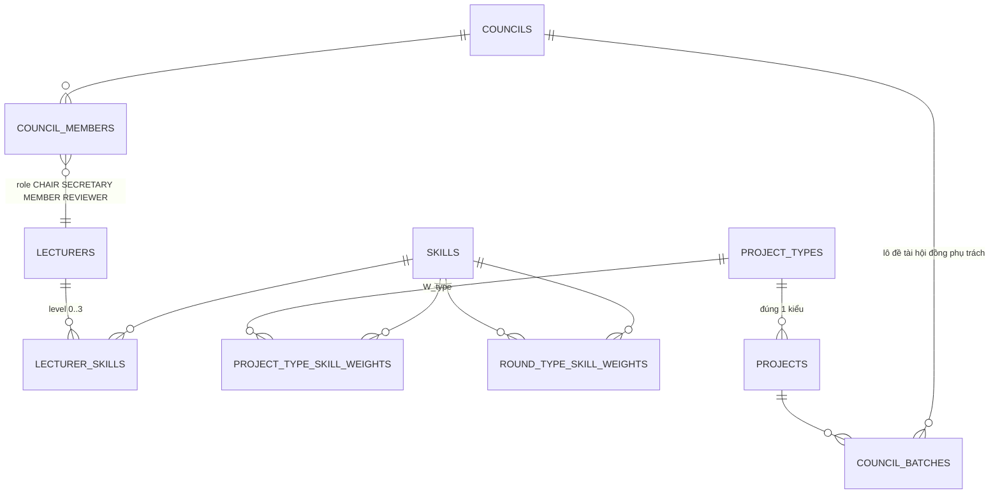
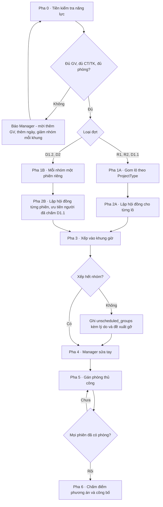

# THUẬT TOÁN XẾP LỊCH HỘI ĐỒNG — v1.0

**Ngày:** 19/08/2026 · **Nối tiếp:** `EntityAndStates_v2.0.md`
**Thay thế:** mục 6 của `BusinessRules_v1.0.md`, mục 7 của `PRD_v1.0.md`

---

## 1. Bốn quyết định của vòng này

| # | Quyết định | Ảnh hưởng |
|---|---|---|
| **Q12** | Khôi phục vai **Chủ tịch / Thư ký** cho cả D1.1, D1.2, D2. Review 1/2 giữ nguyên **ngang hàng**, ghép theo chuyên môn | ⚠️ **Đảo ngược PRD v1.0 mục 2.3** — dòng "Reviewer ngang hàng, xóa vai CT/PB/TK" phải bỏ |
| **Q13** | Tỉ lệ % đề tài cùng GVHD đo **trong phạm vi một hội đồng** | Ràng buộc cứng mới H15 |
| **Q14** | Skill: **cứng cho vai** (CT phải biết điều phối, TK phải có kinh nghiệm thư ký), **mềm cho chuyên môn** | Ràng buộc cứng mới H14 + ràng buộc mềm mới S2 |
| **Q15** | Một đề tài mang **đúng 1 ProjectType** | Bảng `project_types` + ma trận trọng số |

---

## 2. Thực thể mới

### 2.1. Bộ kỹ năng

Chia làm **hai nhóm khác hẳn nhau về cách dùng** — đây là điểm mấu chốt của Q14.

| Nhóm | Mã | Tên | Dùng để |
|---|---|---|---|
| **ROLE** | `FACILITATION` | Điều phối cuộc họp | **Điều kiện cứng** để làm Chủ tịch |
| **ROLE** | `SECRETARY` | Kinh nghiệm làm thư ký | **Điều kiện cứng** để làm Thư ký |
| **DOMAIN** | `BA` | BA nghiệp vụ | Tính điểm khớp chuyên môn |
| **DOMAIN** | `TECH` | Công nghệ | nt |
| **DOMAIN** | `ALGO` | Thuật toán và giải thuật | nt |
| **DOMAIN** | `RESEARCH` | Nghiên cứu khoa học | nt |
| **DOMAIN** | *(mở rộng)* | UI/UX, Dữ liệu, Bảo mật, DevOps… | nt |

**Thang mức đề xuất — 4 bậc:** `0` Không có · `1` Cơ bản · `2` Thành thạo · `3` Chuyên sâu.

Lý do chọn 4 bậc thay vì 5: Bộ môn phải nhập tay 26 giảng viên × ~8 kỹ năng = 208 ô. Thang càng nhiều bậc thì người nhập càng do dự và dữ liệu càng nhiễu, trong khi thuật toán chỉ cần phân biệt được "không dùng được / dùng tạm / dùng tốt".

### 2.2. Kiểu đề tài và ma trận trọng số

`project_types` là bảng do Bộ môn tự định nghĩa, ví dụ: `WEB_BUSINESS`, `MOBILE`, `AI_ML`, `DATA_PLATFORM`, `RESEARCH`, `GAME`.

⭐ **Trọng số kỹ năng phụ thuộc HAI chiều, không phải một.** BR-FLOW-02 đã ghi rõ Review 1 đánh giá *Requirement*, Review 2 đánh giá *ERD, cơ sở dữ liệu và công nghệ*. Nghĩa là cùng một đề tài, đợt khác nhau cần chuyên môn khác nhau:

**W_round — trọng số theo loại đợt** (giá trị khởi tạo, sửa được)

| Loại đợt | BA | TECH | ALGO | RESEARCH |
|---|---:|---:|---:|---:|
| Review 1 — *Requirement* | **70** | 15 | 5 | 10 |
| Review 2 — *ERD, DB, công nghệ* | 15 | **65** | 15 | 5 |
| Defense 1.1 | 30 | 30 | 20 | 20 |
| Defense 1.2 | 25 | 30 | 25 | 20 |
| Defense 2 | 25 | 30 | 25 | 20 |

**W_type — trọng số theo kiểu đề tài** (ví dụ)

| ProjectType | BA | TECH | ALGO | RESEARCH |
|---|---:|---:|---:|---:|
| `WEB_BUSINESS` | **50** | 35 | 10 | 5 |
| `AI_ML` | 15 | 25 | **35** | 25 |
| `RESEARCH` | 10 | 20 | 25 | **45** |

**Trọng số hiệu dụng** khi xếp giảng viên cho đề tài *p* ở đợt *r*:

```
w(s) = α_r × W_round[r][s] + (1 − α_r) × W_type[type(p)][s]
```

`α_r` cấu hình theo đợt. Đề xuất **α = 0.7 cho Review 1/2** (đợt quyết định nội dung cần xem) và **α = 0.35 cho các đợt Defense** (đánh giá tổng thể, kiểu đề tài quan trọng hơn).

### 2.3. Vai trong hội đồng

`council_members.role` ∈ `CHAIR` · `SECRETARY` · `MEMBER` · `REVIEWER`

`REVIEWER` dùng cho Review 1/2 — ngang hàng, không phân vai.

> **Lưu ý phạm vi:** hệ thống **không** sinh biên bản 07.20a (PRD mục 2.2 loại khỏi phạm vi). Vai Thư ký ở đây chỉ để **xếp đúng người có kỹ năng vào phiên**; việc ghi biên bản vẫn diễn ra ngoài hệ thống.

### 2.4. ERD bổ sung



Cột thêm vào bảng `rounds`:

| Cột | Ý nghĩa |
|---|---|
| `uses_council_roles` | TRUE cho D1.1/D1.2/D2, FALSE cho R1/R2 |
| `chair_min_level` | Ngưỡng skill `FACILITATION` để được làm CT (mặc định 2) |
| `secretary_min_level` | Ngưỡng skill `SECRETARY` (mặc định 2) |
| `max_same_supervisor_ratio` | H15 — mặc định 50% |
| `batch_size` | Số đề tài tối đa một hội đồng phụ trách liên tiếp |
| `alpha_round_weight` | α_r ở mục 2.2 |

---

## 3. Điểm khớp kỹ năng

**Điểm cá nhân** của giảng viên *l* với đề tài *p* ở đợt *r*:

```
fit(l, p, r) = Σ_s w(s) × level(l, s)  /  ( 3 × Σ_s w(s) )        ∈ [0, 1]
```

**Điểm hội đồng** với một lô đề tài *B* — dùng **max**, không dùng trung bình:

```
CouncilFit(C, B, r) = Σ_s w̄(s) × max_{l ∈ C} level(l, s)  /  ( 3 × Σ_s w̄(s) )
                        với w̄(s) = trung bình w(s) trên các đề tài trong lô
```

> ⭐ **Vì sao dùng `max` chứ không phải trung bình:** hội đồng cần **phủ** được các mặt chuyên môn, không cần mọi thành viên đều giỏi mọi thứ. Nếu dùng trung bình, thuật toán sẽ chọn 5 người "đều đều" giống nhau. Dùng max, thuật toán tự chọn một người mạnh BA + một người mạnh công nghệ + một người mạnh thuật toán — đúng cách một hội đồng thật được ghép.

---

## 4. Ràng buộc cứng — bản cập nhật

| Mã | Ràng buộc | Tình trạng |
|---|---|---|
| **H1** | GVHD không chấm đề tài mình hướng dẫn. ⭐ **Mở rộng:** khi hội đồng phụ trách một **lô**, cấm với **mọi** đề tài trong lô | Sửa |
| **H2** | Một GV không ở 2 phiên trùng khung giờ | Giữ |
| **H3** | Một phòng không có 2 phiên trùng giờ | → chuyển thành **validation** khi gán phòng tay (v2.0 Q1) |
| **H4** | Một nhóm đúng 1 phiên trong 1 đợt | Giữ |
| **H5** | Cấu trúc hội đồng theo loại đợt — **viết lại** | Sửa |
| **H6** | Một GV chỉ 1 vai trong 1 hội đồng | Giữ |
| **H7** | Chỉ xếp GV vào khung đã đăng ký rảnh | Giữ |
| **H8** | Không xếp GV đã khai xung đột lợi ích | Giữ |
| **H9** | Nhóm phải đúng `projects.status` của loại đợt | Giữ |
| **H10** | Tôn trọng khung giờ nhóm đã chọn | Giữ |
| **H11** | D1.2 giữ ≥1 người đã chấm D1.1 của chính nhóm đó | Giữ |
| **H12** | Trần 240 phút/buổi, 480 phút/ngày, + hạn mức kỳ | Giữ |
| **H13** | Số phiên/khung ≤ `max_groups_per_timeslot` | Giữ |
| **H14** | ⭐ **Vai phải đủ kỹ năng:** CT cần `FACILITATION ≥ chair_min_level`, TK cần `SECRETARY ≥ secretary_min_level` | **Mới** |
| **H15** | ⭐ **Tỉ lệ GVHD trong lô:** với mọi GVHD *g*, số đề tài của *g* trong lô ≤ `⌊ratio × |lô|⌋`, tối thiểu 1 | **Mới** |
| **H16** | ⭐ Hội đồng Defense có **đúng 1 CT và đúng 1 TK**, hai người khác nhau | **Mới** |

**H5 viết lại — cấu trúc hội đồng:**

| Loại đợt | Cỡ | Cấu trúc |
|---|---:|---|
| Review 1 | 2 | 2 × `REVIEWER` ngang hàng |
| Review 2 | 2 | 2 × `REVIEWER` ngang hàng |
| Defense 1.1 | 3 | 1 `CHAIR` + 1 `SECRETARY` + 1 `MEMBER` |
| Defense 1.2 | 5 | 1 `CHAIR` + 1 `SECRETARY` + 3 `MEMBER` |
| Defense 2 | 5 | 1 `CHAIR` + 1 `SECRETARY` + 3 `MEMBER` |

---

## 5. Ràng buộc mềm — bản cập nhật

| Mã | Ràng buộc mềm | Ưu tiên đề xuất |
|---|---|---|
| **S1** | Cân bằng tải theo **% hạn mức kỳ đã dùng**, điều chỉnh theo mức ưu tiên GV tự chọn | 1 |
| **S2** | ⭐ **Điểm khớp chuyên môn** `CouncilFit` cao nhất có thể | **2** |
| **S3** | ⭐ **Gom đề tài cùng ProjectType** vào cùng hội đồng / cùng buổi | **3** |
| **S4** | Review 2 giữ nguyên cặp GV đã chấm Review 1 | 4 |
| **S5** | D1.2 giữ **thêm người thứ 2** từ hội đồng D1.1 | 5 |
| **S6** | Gom phiên của cùng GV liên tiếp trong một buổi | 6 |
| **S7** | Giảm số ngày mỗi GV phải có mặt | 7 |
| **S8** | ⭐ **Đa dạng GVHD** — phần vượt trên mức H15 đã chặn cứng | 8 |
| **S9** | Giữ tổ hợp hội đồng ổn định giữa các phiên liên tiếp | 9 |
| ~~cũ~~ | ~~Dùng ít phòng nhất~~ | **Bỏ** — phòng gán tay (v2.0 Q1) |

> ⚠️ **Xung đột cần biết trước:** S2 (khớp chuyên môn) và S1 (cân bằng tải) **kéo ngược nhau**. Nếu chỉ có 3 giảng viên mạnh `ALGO` mà kỳ này có 20 đề tài `AI_ML`, tối ưu S2 sẽ dồn cả 20 phiên lên 3 người đó. Trọng số phải cấu hình được, và bảng điều khiển ở FR-5.10 cần hiện **cả hai** chỉ số cạnh nhau.

---

## 6. Flow xếp lịch — 6 pha



### Pha 0 — Tiền kiểm tra năng lực

Chạy **trước** khi tốn thời gian tối ưu. Bốn phép kiểm:

1. `số GV đã ACCEPTED × 1` ≥ `cỡ hội đồng × số hội đồng song song`
2. Số GV đạt `chair_min_level` ≥ số hội đồng song song *(chỉ đợt Defense)*
3. Số GV đạt `secretary_min_level` ≥ số hội đồng song song
4. Số phòng khả dụng ≥ `max_groups_per_timeslot`

Phép kiểm 2 và 3 là **hoàn toàn mới** và là thứ dễ làm hỏng cả đợt nhất — xem mô phỏng ở Phần 8.

### Pha 1A — Gom lô theo ProjectType

Chỉ chạy khi `council_reuse_mode = TRUE`.

- Sắp đề tài theo `project_type`, trong mỗi kiểu **rải vòng theo GVHD** để H15 không bị vi phạm ngay từ đầu
- Cắt thành lô kích thước `batch_size`
- Lô lẻ cuối của mỗi kiểu được ghép với kiểu **gần nhất** — đo bằng độ tương đồng cosine giữa hai vector `W_type`, không ghép bừa

### Pha 2A/2B — Lập hội đồng, thứ tự CT → TK → thành viên

Thứ tự này **không phải quy ước hành chính mà là chiến lược tìm kiếm**: chọn tài nguyên khan hiếm nhất trước. Chỉ khoảng một nửa giảng viên đủ điều kiện làm Chủ tịch; nếu để cuối, thuật toán sẽ liên tục phải quay lui. Đây là heuristic *most-constrained-first* kinh điển.

Thành viên còn lại được chọn theo kiểu **lấp lỗ hổng**: mỗi bước tìm kỹ năng đang thiếu nhất so với nhu cầu của lô, rồi lấy người mạnh nhất ở kỹ năng đó.

### Pha 3 — Xếp vào khung giờ

Với chế độ lô: cả lô phải nằm trong **chuỗi khung giờ liên tiếp cùng buổi**, và **mọi** thành viên hội đồng phải rảnh ở **mọi** khung trong chuỗi (H7). Đây là ràng buộc chặt hơn hẳn cách xếp từng phiên rời.

### Pha 4–6

Sửa tay (chặn cứng H1/H2/H14/H16, cảnh báo + bắt lý do với phần còn lại) → gán phòng thủ công → chấm điểm và công bố. Guard công bố đã chốt ở v2.0: **không cho công bố khi còn phiên thiếu phòng**.

---

## 7. Pseudocode — lập hội đồng

```
function formCouncil(batch, round, freeLecturers):

    # ---- lọc theo ràng buộc cứng ----
    P = freeLecturers
    P = P \ supervisorsOf(batch)                    # H1 mở rộng cho CẢ LÔ
    P = P \ conflictDeclaredWith(batch)             # H8
    P = P ∩ availableAtAll(batch.timeslots)         # H7
    P = P \ overQuota(round)                        # H12

    council = []

    if round.uses_council_roles:
        # ---- 1. CHỦ TỊCH: tài nguyên khan hiếm nhất ----
        Cands = { l ∈ P : level(l, FACILITATION) ≥ round.chair_min_level }    # H14
        if Cands = ∅ : return FAIL("không còn GV đủ điều kiện Chủ tịch")
        chair = argmax_{l ∈ Cands} score(l, batch, round)
        council += (chair, CHAIR);  P −= chair

        # ---- 2. THƯ KÝ ----
        Cands = { l ∈ P : level(l, SECRETARY) ≥ round.secretary_min_level }   # H14
        if Cands = ∅ : return FAIL("không còn GV đủ điều kiện Thư ký")
        sec = argmax_{l ∈ Cands} score(l, batch, round)
        council += (sec, SECRETARY);  P −= sec

    # ---- 3. Thành viên còn lại: lấp lỗ hổng kỹ năng ----
    while |council| < round.council_size:
        if P = ∅ : return FAIL("không đủ giảng viên")
        gap = argmax_s  w̄(s) × ( 3 − coverage(council, s) )
        m   = argmax_{l ∈ P} [ β₁ × level(l, gap)/3
                             + β₂ × fit(l, batch, round)
                             + β₃ × loadHeadroom(l)
                             − β₄ × supervisorOverlap(l, batch) ]
        council += (m, MEMBER);  P −= m

    return council


function score(l, batch, round):
    return β₂ × fit(l, batch, round) + β₃ × loadHeadroom(l)

function loadHeadroom(l):
    # còn bao nhiêu dư địa so với hạn mức kỳ, đã điều chỉnh theo mức ưu tiên GV chọn
    return 1 − usedMinutes(l) / ( quota(l) × preferenceFactor(l) )
```

`preferenceFactor` theo BR-AVL-03: `HIGH = 1.3` · `MEDIUM = 1.0` · `LOW = 0.7`.

---

## 8. Kiểm chứng bằng mô phỏng

> **Giả định:** 26 giảng viên · 74 đề tài · 70% đề tài có 1 GVHD, 30% có 2 · GVHD phân bố ngẫu nhiên đều · mỗi cấu hình chạy 600–800 lần.

### 8.1. Trần cứng theo đầu người

Trước mọi chuyện về kỹ năng, số hội đồng chạy song song bị chặn bởi phép chia đơn giản:

| % GV rảnh ở khung đó | Số GV | HĐ 2 người | HĐ 3 người | HĐ 5 người |
|---:|---:|---:|---:|---:|
| 60% | 16 | 8 | 5 | 3 |
| 70% | 18 | 9 | 6 | 3 |
| 80% | 21 | 10 | 7 | 4 |
| 100% | 26 | 13 | 8 | **5** |

> ⚠️ **PRD mục 2.4 đang giả định 8 hội đồng song song ở D1.1 và 5 ở D1.2 — con số đó chỉ đúng khi 100% giảng viên rảnh ở đúng khung giờ đó.** Ở mức thực tế 70%, trần thật là **6 và 3**. Đây là sai lệch nghiêm trọng nhất tôi tìm thấy trong bộ tài liệu hiện tại.

### 8.2. Kỹ năng vai làm hỏng thêm bao nhiêu

Tỉ lệ xếp kín được một khung giờ, giả định 100% GV rảnh, lô 4 nhóm:

| % GV có skill CT và TK | D1.1 — 8 HĐ | D1.2 — 5 HĐ | D1.2 — 4 HĐ |
|---:|---:|---:|---:|
| 20% | 0% | 4% | 50% |
| 30% | 0% | 41% | 92% |
| 40% | 20% | 56% | 98% |
| 50% | 69% | 65% | **100%** |
| 70% | 93% | 69% | 100% |
| 100% | 96% | **69%** | 100% |

Lùi một bậc dưới trần để chừa dự phòng:

| % GV có skill CT và TK | D1.1 — 7 HĐ | D1.2 — 4 HĐ | D1.2 — 3 HĐ |
|---:|---:|---:|---:|
| 30% | 18% | 93% | 100% |
| 40% | 71% | 98% | 100% |
| **50%** | **95%** | **100%** | **100%** |
| 70% | 100% | 100% | 100% |

### 8.3. Giá phải trả của việc gom lô

D1.1, 7 hội đồng song song, 40% GV có kỹ năng vai:

| Kích thước lô | Tỉ lệ lập được hội đồng |
|---:|---:|
| 1 nhóm | 79% |
| 2 nhóm | 76% |
| 3 nhóm | 73% |
| 4 nhóm | 67% |
| 6 nhóm | 57% |
| 8 nhóm | 45% |

Mỗi nhóm thêm vào lô làm giảm khoảng **3–5 điểm phần trăm** khả năng lập được hội đồng — vì H1 mở rộng loại thêm GVHD của nhóm đó khỏi danh sách ứng viên.

### 8.4. Bốn khuyến nghị rút ra

| # | Khuyến nghị | Căn cứ |
|---|---|---|
| **K1** | **Tối thiểu 50% giảng viên (13/26) phải đạt ngưỡng mỗi kỹ năng vai.** Dưới 40% thì D1.1 gần như không xếp nổi | 8.2 |
| **K2** | **`max_groups_per_timeslot` ở D1.2 đặt là 4, không phải 5.** Ở 5, ngay cả khi 100% GV có kỹ năng vai vẫn chỉ đạt 69% | 8.2 |
| **K3** | **`batch_size` đặt 3–4.** Trên 6 thì lợi ích gom ProjectType không bù nổi tỉ lệ thất bại | 8.3 |
| **K4** | **Pha 0 phải kiểm tỉ lệ GV rảnh theo từng khung, không theo cả đợt.** Trần thật được quyết bởi khung giờ vắng người nhất | 8.1 |

---

## 9. Vì sao D1.2 và D2 không gom lô được

`council_reuse_mode` phải **tắt** ở D1.2 và D2, và đây là hệ quả trực tiếp của H11 chứ không phải lựa chọn thiết kế.

H11 đòi hội đồng D1.2 của nhóm X phải chứa ít nhất một người đã chấm D1.1 của **chính nhóm X**. Nếu một hội đồng phụ trách lô 4 nhóm, nó phải đồng thời chứa người cũ của cả 4 nhóm — mà 4 nhóm đó ở D1.1 do 4 hội đồng khác nhau chấm. Cần tới 4 chỗ trong hội đồng 5 người chỉ để thỏa H11, gần như không còn dư địa cho kỹ năng và cân bằng tải.

**Cách bù:** ở D1.2/D2, "ưu tiên cùng kiểu đề tài" hạ từ *cùng hội đồng* xuống *cùng buổi / cùng khung giờ* (ràng buộc mềm S3). Giảng viên vẫn được lợi về mạch tư duy khi chấm liên tiếp các đề tài cùng loại, dù hội đồng có đổi người.

---

## 10. Việc phải sửa ở tài liệu cũ

| Tài liệu | Mục | Sửa gì |
|---|---|---|
| `PRD_v1.0.md` | 2.3 | **Xóa dòng "Vai hội đồng → Reviewer ngang hàng"**; ghi lại theo H5 mới |
| | 2.4 | Sửa cột "Nhóm/khung tối đa lý thuyết" — đang tính theo 100% GV rảnh |
| | 7.1 | Thêm H14, H15, H16; sửa H1 và H5 |
| | 7.2 | Chèn S2, S3; bỏ ràng buộc mềm về số phòng |
| | 4 | Ma trận phân quyền: ai nhập và duyệt kỹ năng giảng viên |
| | FR mới | Quản lý danh mục kỹ năng · nhập kỹ năng GV · quản lý ProjectType · ma trận trọng số · gán ProjectType cho đề tài |
| `BusinessRules_v1.0.md` | 6.1, 6.2 | Thay bằng Phần 4 và 5 của tài liệu này |
| | Từ điển | Định nghĩa lại "Hội đồng" theo cấu trúc vai mới |
| `ERD_v1.0.md` | mục 6 | Thêm trigger cho H14, H15, H16; H1 phải kiểm theo **lô** |
| | schema | 5 bảng mới + 6 cột mới ở `rounds` + `council_members.role` |
| `EntityAndStates_v2.0.md` | 2.2 | Thêm `Skill`, `LecturerSkill`, `ProjectType`, `CouncilBatch` vào nhóm không có vòng đời |

---

## 11. Câu hỏi mở

| # | Câu hỏi | Vì sao cần |
|---|---|---|
| **O11** | Review 1/2 là **2 hay 3 người**? Bạn nói "2-3", PRD đang chốt 2. Chênh này đổi toàn bộ bài toán năng lực | Trần đầu người ở 8.1 |
| **O12** | **Ai nhập kỹ năng giảng viên** — Bộ môn đánh giá, hay GV tự khai rồi Bộ môn duyệt? Tự khai thường lạm phát mức | Chất lượng dữ liệu đầu vào |
| **O13** | Ngưỡng làm Chủ tịch là mức **2 (Thành thạo)** hay chỉ cần **1 (Cơ bản)**? Ở mức 2 mà không đủ 13 người thì D1.1 tắc | K1 |
| **O14** | Tỉ lệ `max_same_supervisor_ratio` cụ thể là bao nhiêu — **50%**? Với lô 4 nhóm, 50% nghĩa là tối đa 2 nhóm cùng thầy | H15 |
| **O15** | Có giảng viên nào **mặc định luôn làm Chủ tịch** theo học hàm/thâm niên không, hay thuần theo kỹ năng? *(câu O3 cũ của BR v1.0 chưa trả lời)* | H14 |
| **O16** | Danh mục ProjectType thật của Bộ môn gồm những kiểu nào, và **ai gán kiểu cho đề tài** — GVHD khi đăng ký đề tài, hay Bộ môn khi duyệt? | Pha 1A |
| **O17** | Bộ kỹ năng DOMAIN có đúng 4 mục như bạn liệt kê, hay còn UI/UX, Bảo mật, Dữ liệu…? | Ma trận trọng số |
| **O18** | Khi S2 và S1 xung đột (ít người giỏi một kỹ năng hiếm), ưu tiên nào thắng? Đề xuất: **S1 thắng**, S2 chỉ phá thế hòa | Trọng số mặc định |

---

*Tài liệu này là đầu vào cho đặc tả thuật toán chi tiết và test case. Mọi con số ở Phần 8 đều tái lập được bằng mô phỏng kèm theo.*
