# ERD — Capstone Defense Scheduler v1.0

**CSDL đích:** PostgreSQL 14+ · **Ngày:** 17/08/2026
**Tài liệu liên quan:** `PRD_v1.0.md`, `BusinessRules_v1.0.md`, `schema.sql`

---

## 1. Quyết định thiết kế

| Mã | Quyết định | Lý do |
|---|---|---|
| **E1** | `users` (auth) + `lecturers` / `students` (profile 1-1) | FK nghiệp vụ trỏ thẳng vào `lecturer_id` / `student_id`, không thể lọt sinh viên vào chỗ cần giảng viên |
| **E2** | PK `BIGINT IDENTITY` + mã nghiệp vụ là `UNIQUE` riêng | Đổi mã đề tài không vỡ FK; import dữ liệu lỗi vẫn sửa được |
| **E3** | `sessions` thuộc `schedule_versions` | Manager chạy thuật toán nhiều lần, so sánh, chọn một; xoá phương án nháp là cascade |
| **E4** | Có bảng `councils` tái sử dụng được | Một hội đồng chấm nhiều phiên liên tiếp trong buổi |
| **E5** | `rounds.council_reuse_mode` bật/tắt theo đợt | Bật cho Review 1/2 và D1.1; tắt cho D1.2/D2 để thoả H11 |
| **E6** | `council_members` **bất biến**; đổi người ⇒ council mới + `derived_from_council_id` | Truy vấn "ai chấm phiên X" luôn đúng, không cần lọc theo thời điểm |
| **E7** | Một bảng `audit_logs` generic + `jsonb` | Một chỗ cho mọi thực thể, không thêm bảng mỗi lần mở rộng |
| **E8** | Một bảng `session_results` chung Review và Defense | Truy vấn lịch sử nhóm không phải UNION |
| **E9** | PostgreSQL | `jsonb`, native ENUM, **partial unique index** — dùng rất nhiều trong schema này |
| **E10** | Native ENUM / CHECK | Gọn, nhanh; đổi tập giá trị chấp nhận migration |
| **E11** | Soft delete `deleted_at` + lọc theo `semester_id` | Quy mô 5 kỳ vẫn nhỏ, tra cứu ngang kỳ không cần UNION |
| **E12** | Có `majors` ngay từ V1 | V1 seed 1 dòng SE; mở đa ngành sau không phải migration đau đớn |

---

## 2. Sơ đồ

```mermaid
erDiagram
    MAJORS      ||--o{ LECTURERS : ""
    MAJORS      ||--o{ STUDENTS : ""
    MAJORS      ||--o{ PROJECTS : ""
    MAJORS      ||--o{ ROUNDS : ""

    USERS       ||--|| LECTURERS : "1-1 profile"
    USERS       ||--|| STUDENTS : "1-1 profile"

    SEMESTERS   ||--o{ PROJECTS : ""
    SEMESTERS   ||--o{ GROUPS : ""
    SEMESTERS   ||--o{ ROUNDS : ""
    SEMESTERS   ||--o{ LECTURER_SEMESTER_QUOTAS : ""
    LECTURERS   ||--o{ LECTURER_SEMESTER_QUOTAS : "hạn mức kỳ"

    PROJECTS    ||--o{ PROJECT_SUPERVISORS : ""
    LECTURERS   ||--o{ PROJECT_SUPERVISORS : "GVHD chính/phụ"
    PROJECTS    ||--|| GROUPS : "1-1"
    PROJECTS    ||--o{ CONFLICT_DECLARATIONS : ""
    LECTURERS   ||--o{ CONFLICT_DECLARATIONS : "xung đột lợi ích"

    GROUPS      ||--o{ GROUP_MEMBERS : ""
    STUDENTS    ||--o{ GROUP_MEMBERS : ""

    ROUNDS      ||--o{ ROUND_DAYS : "nhiều ngày đánh giá"
    ROUND_DAYS  ||--o{ TIMESLOTS : "nhiều khung giờ"
    ROUNDS      ||--o{ ROUND_GROUPS : ""
    GROUPS      ||--o{ ROUND_GROUPS : ""
    ROUNDS      ||--o{ ROUND_ROOMS : ""
    ROOMS       ||--o{ ROUND_ROOMS : ""

    ROUNDS      ||--o{ ROUND_INVITATIONS : ""
    LECTURERS   ||--o{ ROUND_INVITATIONS : "mời + mức ưu tiên tải"
    TIMESLOTS   ||--o{ LECTURER_AVAILABILITIES : ""
    LECTURERS   ||--o{ LECTURER_AVAILABILITIES : "đăng ký rảnh"
    TIMESLOTS   ||--o{ GROUP_SLOT_PREFERENCES : ""
    GROUPS      ||--o{ GROUP_SLOT_PREFERENCES : "leader chọn"

    ROUNDS      ||--o{ COUNCILS : ""
    COUNCILS    ||--o{ COUNCIL_MEMBERS : "bất biến"
    LECTURERS   ||--o{ COUNCIL_MEMBERS : ""
    COUNCILS    ||--o{ COUNCILS : "derived_from"

    ROUNDS            ||--o{ SCHEDULE_VERSIONS : "nhiều phương án"
    SCHEDULE_VERSIONS ||--o{ SESSIONS : ""
    SCHEDULE_VERSIONS ||--o{ UNSCHEDULED_GROUPS : ""
    TIMESLOTS   ||--o{ SESSIONS : ""
    ROOMS       ||--o{ SESSIONS : ""
    GROUPS      ||--o{ SESSIONS : ""
    COUNCILS    ||--o{ SESSIONS : ""
    SESSIONS    ||--o{ SESSION_REVIEWERS : "ảnh chụp người chấm"
    LECTURERS   ||--o{ SESSION_REVIEWERS : ""

    SESSIONS    ||--|| SESSION_RESULTS : ""
    LECTURERS   ||--o{ SESSION_RESULTS : "người nhập / người xác nhận"
    SESSIONS    ||--o{ RESCHEDULE_REQUESTS : ""

    USERS       ||--o{ NOTIFICATIONS : ""
    USERS       ||--o{ AUDIT_LOGS : "actor"
    SEMESTERS   ||--o{ IMPORT_BATCHES : ""
```



---

## 3. Nhóm bảng

### 3.1. Master data (7 bảng)

| Bảng | Vai trò | Điểm đáng chú ý |
|---|---|---|
| `majors` | Ngành | V1 seed 1 dòng `SE` |
| `users` | Đăng nhập, role hệ thống | `role` là 1 trong 4: ADMIN, MANAGER, LECTURER, STUDENT |
| `lecturers` | Hồ sơ giảng viên | `lecturer_code` UNIQUE — khoá dùng trong mọi liên kết lịch, giải quyết vấn đề 2 định danh trong dữ liệu SU26 |
| `students` | Hồ sơ sinh viên | |
| `rooms` | Phòng | Có `is_online` cho buổi trên MS Teams |
| `semesters` | Học kỳ | Partial unique đảm bảo **đúng 1 kỳ ACTIVE** |
| `lecturer_semester_quotas` | Hạn mức phiên/kỳ từng GV | Gốc của mục tiêu cân bằng tải S1 — thuật toán cân bằng theo **% hạn mức đã dùng**, không theo số tuyệt đối |

### 3.2. Đề tài — Nhóm — Sinh viên (5 bảng)

| Bảng | Điểm đáng chú ý |
|---|---|
| `projects` | `previous_project_id` tự tham chiếu, dùng cho nhóm retake kỳ sau |
| `project_supervisors` | Partial unique `WHERE role='MAIN'` ⇒ **đúng 1 GVHD chính**. Dữ liệu cũ dạng chuỗi `"A và B"` phải tách thành 2 dòng khi import |
| `groups` | `project_id` UNIQUE ⇒ quan hệ 1-1 với đề tài |
| `group_members` | `joined_at` / `left_at` cho lịch sử thành viên; partial unique ⇒ **đúng 1 trưởng nhóm đang hoạt động**; CHECK ràng `status` khớp `left_at` |
| `conflict_declarations` | Nguồn của ràng buộc H8 |

### 3.3. Đợt — Ngày — Khung giờ (5 bảng)

Cấu trúc phân cấp **Đợt → Ngày đánh giá → Khung giờ**:

| Bảng | Điểm đáng chú ý |
|---|---|
| `rounds` | Mang toàn bộ tham số: `session_duration_minutes` (45/60/90), `council_size` (2/3/5), `max_groups_per_timeslot` (H13), `max_minutes_per_part` / `max_minutes_per_day` (H12 — **tính theo phút**, không theo số phiên), 4 cờ chế độ, `soft_weights` jsonb |
| `round_days` | Giờ bắt đầu/kết thúc buổi sáng và chiều; hệ thống sinh khung giờ từ đây |
| `timeslots` | `round_id` phi chuẩn hoá để truy vấn không phải join 2 cấp |
| `round_groups` | Nhóm tham gia đợt |
| `round_rooms` | Phòng khả dụng cho đợt |

### 3.4. Mời & Đăng ký (3 bảng)

| Bảng | Điểm đáng chú ý |
|---|---|
| `round_invitations` | `preferred_load_level` (LOW/MEDIUM/HIGH) — giảng viên tự chọn mức ưu tiên khối lượng. CHECK bắt buộc lý do khi DECLINED |
| `lecturer_availabilities` | Không có dòng = bận (BR-AVL-04). `source` phân biệt GV tự đăng ký hay Manager nhập hộ |
| `group_slot_preferences` | Chỉ dùng khi `group_selection_mode = TRUE`. Không có dòng = rảnh mọi khung (BR-AVL-07 — **ngược quy tắc của giảng viên**) |

### 3.5. Hội đồng (2 bảng)

`council_members` **bất biến**. Khi phải đổi người giữa chừng:

```sql
-- 1. Tạo hội đồng dẫn xuất
INSERT INTO councils(round_id, code, derived_from_council_id, change_reason, created_by)
VALUES (1, 'HD1-b', 1, 'GV Ba báo ốm sáng 19/08', :manager_user_id)
RETURNING id;

-- 2. Sao thành viên cũ, thay người cần đổi
INSERT INTO council_members(council_id, lecturer_id)
SELECT :new_council, lecturer_id FROM council_members
WHERE council_id = 1 AND lecturer_id <> :old_lecturer;
INSERT INTO council_members(council_id, lecturer_id) VALUES (:new_council, :new_lecturer);

-- 3. Trỏ lại các phiên CHƯA diễn ra
UPDATE sessions SET council_id = :new_council
WHERE council_id = 1 AND status = 'SCHEDULED' AND timeslot_id IN (...);
```

Các phiên đã hoàn thành vẫn trỏ về council cũ ⇒ **kết quả và biên bản không bị ảnh hưởng hồi tố** (BR-PUB-05).

### 3.6. Lịch (4 bảng)

| Bảng | Điểm đáng chú ý |
|---|---|
| `schedule_versions` | `soft_scores` jsonb lưu điểm từng ràng buộc mềm S1–S8 để so sánh phương án. Partial unique ⇒ **đúng 1 phương án active/đợt** |
| `sessions` | Hai UNIQUE cưỡng chế H3 và H4 ở mức khai báo |
| `session_reviewers` | Ảnh chụp người chấm — xem mục 4 dưới đây |
| `unscheduled_groups` | `reason_code` giải thích **vì sao** nhóm không xếp được (FR-5.4) |

### 3.7. Kết quả, yêu cầu, nhật ký (5 bảng)

| Bảng | Điểm đáng chú ý |
|---|---|
| `session_results` | Hai CHECK đối xứng: mức 2 **bắt buộc** có hạn + người xác nhận; mức khác **cấm** mang dữ liệu khắc phục. Partial index trên `remediation_due_at WHERE verify_status='PENDING'` để quét quá hạn nhanh |
| `reschedule_requests` | Yêu cầu hoãn/đổi từ Lecturer hoặc Leader |
| `notifications` | Partial index `WHERE NOT is_read` — bảng này lớn nhanh nhất |
| `audit_logs` | Generic, `old_value`/`new_value` jsonb, index trên `(entity_type, entity_id, created_at DESC)` |
| `import_batches` | `summary` jsonb chứa kết quả tiền kiểm tra của FR-2.10 |

---

## 4. Điểm thiết kế cần giải thích: `session_reviewers`

`sessions.council_id` đã trỏ tới `councils`, và `council_members` cho ra danh sách người chấm. Vậy tại sao vẫn cần `session_reviewers`?

**Vì H2 — "một giảng viên không ở 2 phiên trùng khung giờ" — không diễn đạt được ở mức khai báo nếu chỉ có `council_members`.** Ràng buộc này bắc qua ba bảng: giảng viên nằm ở `council_members`, khung giờ nằm ở `sessions`. PostgreSQL không cho `UNIQUE` bắc qua bảng.

`session_reviewers` giải quyết bằng cách phi chuẩn hoá `schedule_version_id` và `timeslot_id` xuống cùng một dòng với `lecturer_id`:

```sql
CONSTRAINT uq_lecturer_timeslot UNIQUE (schedule_version_id, timeslot_id, lecturer_id)
```

Đây là **ràng buộc quan trọng nhất của cả hệ thống** và giờ nó được database bảo đảm tuyệt đối — không thuật toán lỗi nào, không thao tác sửa tay nào, không câu SQL vá dữ liệu nào có thể tạo ra lịch trùng giờ.

**Cái giá:** hai cột phi chuẩn hoá cần trigger giữ đồng bộ khi `sessions.timeslot_id` đổi. Đổi lại là một bất biến được cưỡng chế ở tầng thấp nhất. Với hệ thống xếp lịch, đây là đánh đổi đáng.

Ngoài ra `session_reviewers` còn là **ảnh chụp lịch sử**: nếu sau này quy tắc "council bất biến" bị nới, dữ liệu ai đã thực sự chấm phiên nào vẫn còn nguyên.

---

## 5. Ràng buộc được cưỡng chế ở tầng database

| Ràng buộc | Cơ chế | Đã kiểm chứng |
|---|---|---|
| Đúng 1 học kỳ ACTIVE | `ux_semesters_single_active` (partial unique) | ✔ |
| Đúng 1 GVHD chính/đề tài | `ux_project_one_main_supervisor` (partial unique) | ✔ |
| Đúng 1 trưởng nhóm đang hoạt động | `ux_group_one_active_leader` (partial unique) | ✔ |
| **H2** — GV không trùng khung giờ | `uq_lecturer_timeslot` | ✔ |
| **H3** — phòng không trùng khung giờ | `uq_session_room` | ✔ |
| **H4** — 1 nhóm 1 phiên/phương án | `uq_session_group` | ✔ |
| Đúng 1 phương án lịch active/đợt | `ux_schedule_one_active` (partial unique) | ✔ |
| Mức 2 phải có hạn + người xác nhận | `ck_result_remediation` | ✔ |
| Mức khác không mang dữ liệu khắc phục | `ck_result_no_remediation` | ✔ |
| Từ chối lời mời phải có lý do | `ck_decline_reason` | ✔ |
| Hội đồng dẫn xuất phải có lý do | `ck_council_change_reason` | ✔ |
| Drop out phải có ngày hiệu lực | `ck_drop_consistency` | ✔ |

Toàn bộ đã chạy thử trên PostgreSQL 16 với dữ liệu thật: 16 ca kiểm thử, mọi ca chặn và cho qua đúng như thiết kế.

---

## 6. Ràng buộc phải xử lý bằng trigger hoặc tầng ứng dụng

Những ràng buộc dưới đây tham chiếu nhiều bảng hoặc cần phép tổng hợp — SQL khai báo không diễn đạt được.

| Mã | Ràng buộc | Ghi chú triển khai |
|---|---|---|
| **H1** | GVHD không chấm đề tài mình hướng dẫn | Trigger trên `session_reviewers`. **Khi `council_reuse_mode = TRUE` phải kiểm với TẤT CẢ nhóm mà hội đồng đó phụ trách**, không chỉ nhóm của phiên đang thêm |
| **H5** | Số thành viên hội đồng = `rounds.council_size` | Constraint trigger DEFERRABLE, kiểm ở cuối giao dịch |
| **H7** | Chỉ xếp GV vào khung đã đăng ký rảnh | `EXISTS` trong `lecturer_availabilities` |
| **H8** | Không xếp GV đã khai báo xung đột | `EXISTS` trong `conflict_declarations` |
| **H9** | Nhóm phải đúng `group_status` cho loại đợt | R1/R2/D1.1 → `ACTIVE` · D1.2 → `ELIGIBLE_D12` hoặc `D12_CONDITIONAL` · D2 → `PENDING_D2` |
| **H10** | Tôn trọng lựa chọn khung giờ của nhóm | Chỉ khi `group_selection_mode = TRUE` và nhóm đã chọn |
| **H11** | D1.2 giữ ≥1 người từ D1.1 của chính nhóm đó | Truy ngược qua `session_results` → `sessions` → `session_reviewers` của đợt D1.1 |
| **H12** | Trần phút/buổi và phút/ngày | `SUM(session_duration_minutes)` nhóm theo (lecturer, ngày, buổi) |
| **H13** | Số phiên/khung ≤ `max_groups_per_timeslot` | `COUNT(sessions)` theo `timeslot_id` |
| — | `outcome` phải khớp `round_type` | `REVIEW_*` chỉ cho đợt Review; `DEFENSE_L*` chỉ cho đợt Defense |
| — | Điều hướng `groups.status` sau khi ghi kết quả | L1→`ELIGIBLE_D12` · L2→`D12_CONDITIONAL` · L3→`PENDING_D2` · L4→`FAILED`. **Kết quả Review không đổi status** |
| — | Đồng bộ `session_reviewers` từ `council_members` | Khi gán/đổi `sessions.council_id` hoặc `timeslot_id` |

> **Lưu ý BR-STU-03:** nhóm dưới 4 thành viên **chỉ cảnh báo, không chặn**. Đừng cài đặt thành ràng buộc.

---

## 7. Truy vấn mẫu

**Lịch cá nhân của một giảng viên (FR-8.1)**

```sql
SELECT r.name AS dot, rd.day_date, t.start_time, t.end_time,
       rm.code AS phong, g.group_code, p.project_code, p.title_vi
FROM session_reviewers sr
JOIN sessions s            ON s.id = sr.session_id
JOIN schedule_versions sv  ON sv.id = s.schedule_version_id AND sv.is_active
JOIN rounds r              ON r.id = s.round_id AND r.status IN ('PUBLISHED','ONGOING','COMPLETED')
JOIN timeslots t           ON t.id = s.timeslot_id
JOIN round_days rd         ON rd.id = t.round_day_id
JOIN rooms rm              ON rm.id = s.room_id
JOIN groups g              ON g.id = s.group_id
JOIN projects p            ON p.id = g.project_id
WHERE sr.lecturer_id = :lecturer_id
ORDER BY rd.day_date, t.start_time;
```

**Báo cáo tải giảng viên theo % hạn mức kỳ (FR-8.5)**

```sql
SELECT l.lecturer_code, u.full_name,
       COUNT(*) AS so_phien,
       SUM(r.session_duration_minutes) / 60.0 AS so_gio,
       q.max_sessions,
       ROUND(100.0 * COUNT(*) / NULLIF(q.max_sessions, 0), 1) AS pct_han_muc
FROM session_reviewers sr
JOIN sessions s           ON s.id = sr.session_id
JOIN schedule_versions sv ON sv.id = s.schedule_version_id AND sv.is_active
JOIN rounds r             ON r.id = s.round_id
JOIN lecturers l          ON l.id = sr.lecturer_id
JOIN users u              ON u.id = l.user_id
LEFT JOIN lecturer_semester_quotas q
       ON q.lecturer_id = l.id AND q.semester_id = r.semester_id
WHERE r.semester_id = :semester_id
GROUP BY l.lecturer_code, u.full_name, q.max_sessions
ORDER BY pct_han_muc DESC NULLS LAST;
```

**Nhóm quá hạn khắc phục (FR-8.7)**

```sql
SELECT g.group_code, p.project_code, res.remediation_due_at,
       CURRENT_DATE - res.remediation_due_at AS so_ngay_qua_han,
       u.full_name AS nguoi_xac_nhan
FROM session_results res
JOIN sessions s   ON s.id = res.session_id
JOIN groups g     ON g.id = s.group_id
JOIN projects p   ON p.id = g.project_id
JOIN lecturers l  ON l.id = res.verifier_lecturer_id
JOIN users u      ON u.id = l.user_id
WHERE res.outcome = 'DEFENSE_L2'
  AND res.verify_status = 'PENDING'
  AND res.remediation_due_at < CURRENT_DATE
  AND res.overdue_closed_at IS NULL
ORDER BY so_ngay_qua_han DESC;
```

**Giảng viên chưa đăng ký lịch rảnh (FR-4.6)**

```sql
SELECT l.lecturer_code, u.full_name, u.email
FROM round_invitations inv
JOIN lecturers l ON l.id = inv.lecturer_id
JOIN users u     ON u.id = l.user_id
WHERE inv.round_id = :round_id
  AND inv.status = 'ACCEPTED'
  AND NOT EXISTS (
      SELECT 1 FROM lecturer_availabilities a
      WHERE a.round_id = inv.round_id AND a.lecturer_id = inv.lecturer_id
  );
```

**Ứng viên hợp lệ để thay người khẩn cấp (FR-6.5)**

```sql
SELECT l.id, l.lecturer_code, u.full_name
FROM lecturers l
JOIN users u ON u.id = l.user_id
JOIN lecturer_availabilities a
      ON a.lecturer_id = l.id AND a.timeslot_id = :timeslot_id
WHERE l.deleted_at IS NULL
  -- H1: không phải GVHD của nhóm này
  AND NOT EXISTS (SELECT 1 FROM project_supervisors ps
                  JOIN groups g ON g.project_id = ps.project_id
                  WHERE g.id = :group_id AND ps.lecturer_id = l.id)
  -- H8: không khai báo xung đột
  AND NOT EXISTS (SELECT 1 FROM conflict_declarations cd
                  JOIN groups g2 ON g2.project_id = cd.project_id
                  WHERE g2.id = :group_id AND cd.lecturer_id = l.id)
  -- H2: đang rảnh khung giờ đó
  AND NOT EXISTS (SELECT 1 FROM session_reviewers sr
                  WHERE sr.lecturer_id = l.id
                    AND sr.timeslot_id = :timeslot_id
                    AND sr.schedule_version_id = :version_id);
```

---

## 8. Ước lượng khối lượng dữ liệu (1 học kỳ, ngành SE)

| Bảng | Số dòng/kỳ | Ghi chú |
|---|---:|---|
| `projects`, `groups` | 74 mỗi bảng | |
| `group_members` | ~350 | |
| `timeslots` | ~150 | 5 đợt × ~30 khung |
| `lecturer_availabilities` | ~3.000 | 26 GV × ~30 khung × 4 đợt |
| `sessions` (mọi phương án) | ~1.500 | 370 phiên × ~4 lần chạy thuật toán |
| `session_reviewers` | ~5.500 | Bảng lớn nhất trong nhóm lịch |
| `notifications` | ~8.000 | Tăng nhanh nhất — cân nhắc dọn định kỳ sau 2 kỳ |
| `audit_logs` | ~5.000 | |

Tổng dưới 30.000 dòng/kỳ. Sau 5 kỳ vẫn dưới 150.000 dòng — **không cần phân vùng**, index thông thường là đủ.

---

## 9. Việc còn phải làm

1. **Viết trigger** cho 12 ràng buộc ở mục 6 — ưu tiên H1 trước, vì đây là ràng buộc nghiệp vụ quan trọng nhất và là cái Excel đang phải dò tay.
2. **Bảng chuyển đổi dữ liệu SU26**: tách `"A và B"` trong cột GVHD thành 2 dòng `project_supervisors`; nối `TaiNT51` ↔ `Nguyễn Trọng Tài` thành một `lecturers`.
3. **Seed `lecturer_semester_quotas`** — thuật toán cân bằng tải không chạy đúng nếu thiếu bảng này.
4. **Quyết định 8 câu mở** còn lại ở PRD mục 12, trong đó **A8 (số phòng khả dụng/ngày)** ảnh hưởng trực tiếp tới `round_rooms` và ràng buộc H3.
